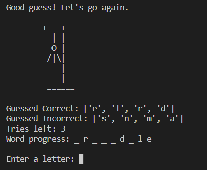

# Welcome to my Hangman-Game

## Play some Hangman from within in your terminal!

Hangman is a fun and interactive game where the user plays a word-guessing game by guessing the letters of a random word generated by the computer. The user will have up to 6 chances for guessing a wrong letter, until the visual on the screen will depict a 'hanged man' indicating you have lost the game. Complete the word in full before your 7 chances are up and you have won the game.

## User Experience (UX)
### User Stories

* As user engaging with the application I want to be able to participate in a word game.
* As user playing the game I want the instructions to be clear.
* As user I want to interact easily with the application.
* As user I want to see my progress on a visual level.
* As a user I want to be informed when my actions/decisions were right or wrong.
* As user I want be able to play again or exit once the game is over.

### Application Goals
* Create a words based guessing challenge for the user.
* Provide the user with an interface to input required actions for the game to be played.
* Include visuals of the user's current status within the game as they play.
* Inform the user when they have used all their chances, or if they have won the game.
* Have the user be able to answer all questions in succession.
* Let the user be able to revert back to the start if they choose play the game again.

### How to Play/Use the App
* User is greeted with a question whether they want to start the game by typing 'yes'.

* User is shown the four rules of the game.

* Message prompts user to to guess the correct randomly generated word and displays a line depicting the length of word.

* User is given 8 chances to guess the wrong letter. On the 8th wrong guess, user loses the game.

* Upon guessing each correct letter, they will appear in their respective position in the word.

* If user guesses the wrong letter, part of a picture will be displayed of a hanging man. 

* Each wrong guess completes the picture further.  

* If user guesses the correct word within the designated amount of tries, they will win the game and be congratulated.

## Application Flow of logic and features

### Start-Game Logic & Workflow

### In-Game Logic & Workflow

## FEATURES
#### Click to expand the info for each feature

  
Starting the game

  FEATURE | IMAGE | DESCRIPTION
  :---:|:---:|:---:
  Prompt to initialize game |  | User gets greeted and asked to start game
  
  <!-- Add more features here -->
  

  
Displaying rules of the game

  FEATURE | IMAGE | DESCRIPTION
  :---:|:---:|:---:
  Rules are displayed one by one to the user before the first play can be made |  | User can examine the rules of the game before starting to play
  
  <!-- Add more features here -->
  

  
In-Game display

  FEATURE | IMAGE | DESCRIPTION
  :---:|:---:|:---:
  User can see the depiction of the gallows followed by in-game information |  | User can see additional information such as the amount of letters needed to be guessed, the amount of tries available, letters guessed correctly and incorrectly
  
  <!-- Add more features here -->
  

  
In-Game Progress

  FEATURE | IMAGE | DESCRIPTION
  :---:|:---:|:---:
  User can see how they are faring as they continue to play the game |  | All in-game information is updated according to what letters they guessed correctly and incorrectly. Ascii art displays hanging man inaccordance with amount of wrong guesses
  
  <!-- Add more features here -->
  

  
User Completes the Word

  FEATURE | IMAGE | DESCRIPTION
  :---:|:---:|:---:
  User is displayed with a congratulatory message |  | Once the word is completed the user is congratulated and prompted to either play again or otherwise quit the game.
  
  <!-- Add more features here -->
  

